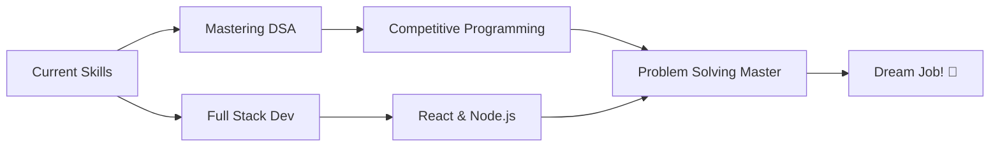

<div align="center">

<!-- Animated Header -->


<!-- Typing Animation -->

<a href="https://git.io/typing-svg"></a>

<!-- Social Badges with Animation -->
<p align="center">
  <a href="https://github.com/biptu123">
    
  </a>
  <a href="https://www.linkedin.com/in/biptudas/">
    
  </a>
  <a href="mailto:biptudas10@gmail.com">
    
  </a>
  
</p>

</div>

<!-- Snake Animation -->
<div align="center">
  
</div>

---

## 🚀 About Me

```typescript
class Developer {
  name: string = "Biptu";
  location: string = "India 🇮🇳";

  skills = {
    languages: ["Java", "JavaScript", "Python", "C"],
    frameworks: ["Node.js", "React"],
    databases: ["MySQL", "MongoDB"],
    tools: ["Git", "VS Code", "Jupyter"],
  };

  currentFocus = "Building innovative projects & mastering DSA";
  hobbies = ["Coding", "Gaming", "Learning new tech"];

  getGreeting(): string {
    return "Thanks for visiting! Let's build something amazing together! 🚀";
  }
}

const me = new Developer();
console.log(me.getGreeting());
```

<details>
<summary>⚡ More about me</summary>
<br>

- 🔭 I'm currently working on **Full Stack Projects**
- 🌱 I'm currently learning **Data Structures & Algorithms**
- 👯 I'm looking to collaborate on **Open Source Projects**
- 💬 Ask me about **Java, JavaScript, Python**
- 🎮 Fun fact: **I built a Ludo game in Java!**
- ⚡ Quote: **"Code is like humor. When you have to explain it, it's bad!"**

</details>

---

## 🛠️ Tech Arsenal

<div align="center">

### 💻 Programming Languages

<table>
  <tr>
    <td align="center" width="96">
      
      <br>Java
    </td>
    <td align="center" width="96">
      
      <br>JavaScript
    </td>
    <td align="center" width="96">
      
      <br>Python
    </td>
    <td align="center" width="96">
      
      <br>C
    </td>
    <td align="center" width="96">
      
      <br>HTML
    </td>
    <td align="center" width="96">
      
      <br>CSS
    </td>
  </tr>
</table>

### 🚀 Frameworks & Libraries

<table>
  <tr>
    <td align="center" width="96">
      
      <br>React
    </td>
    <td align="center" width="96">
      
      <br>Node.js
    </td>
    <td align="center" width="96">
      
      <br>NumPy
    </td>
    <td align="center" width="96">
      
      <br>Pandas
    </td>
  </tr>
</table>

### 🔧 Tools & Platforms

<table>
  <tr>
    <td align="center" width="96">
      
      <br>Git
    </td>
    <td align="center" width="96">
      
      <br>GitHub
    </td>
    <td align="center" width="96">
      
      <br>VS Code
    </td>
    <td align="center" width="96">
      
      <br>Jupyter
    </td>
    <td align="center" width="96">
      
      <br>MySQL
    </td>
    <td align="center" width="96">
      
      <br>MongoDB
    </td>
  </tr>
</table>

</div>

---

## 📊 GitHub Analytics

<div align="center">
  
  
</div>

<div align="center">
  
  
</div>

---

## 🏆 GitHub Trophies & Achievements

<div align="center">
  
</div>

<div align="center">
  
</div>

---

## 🔥 Featured Projects

<div align="center">

### 🎲 [Ludo Game](https://github.com/biptu123/LudoGame)


> A classic Ludo board game implementation in Java

---

### ☕ [Java Programs](https://github.com/biptu123/JavaProgram)


> Collection of Java programming examples and solutions

---

### ⚡ [JavaScript Projects](https://github.com/biptu123/JavaScript)


> JavaScript learning and project repository

---

### 💡 [The Sparks Foundation](https://github.com/biptu123/The-Sparks-Foundation)


> Data Science and Machine Learning internship projects

</div>

---

## 📈 Contribution Graph

<div align="center">
  
</div>

---

## 💭 Random Dev Quote

<div align="center">
  


</div>

---

## 🎯 Current Goals & Learning Path



---

## 🎮 When I'm Not Coding...

<div align="center">

| 🎯 Hobbies           | 📚 Learning         |
| -------------------- | ------------------- |
| Gaming 🎮            | New Technologies 💡 |
| Building Projects 🛠️ | Problem Solving 🧩  |
| Open Source 🌟       | System Design 📐    |

</div>

---

## 📫 Let's Connect!

<div align="center">

[](https://github.com/biptu123)
[](https://www.linkedin.com/in/biptudas/)

<!-- [](https://twitter.com/yourhandle) -->

[](mailto:biptudas10@gmail.com)

<!-- [](https://yourportfolio.com) -->

</div>

<!-- ---

<div align="center">

### 💖 Support My Work

If you like what I do, consider buying me a coffee! ☕

[](https://www.buymeacoffee.com/yourusername)

</div>

--- -->

<div align="center">

### ⚡ Fun Fact of the Day


</div>

---

<!-- Footer Wave -->


<div align="center">
  
### 💻 "Code is poetry written in logic"

**Made with ❤️ by Biptu | Powered by ☕ and 🎵**

⭐ **Star my repos if you find them useful!** ⭐

</div>
