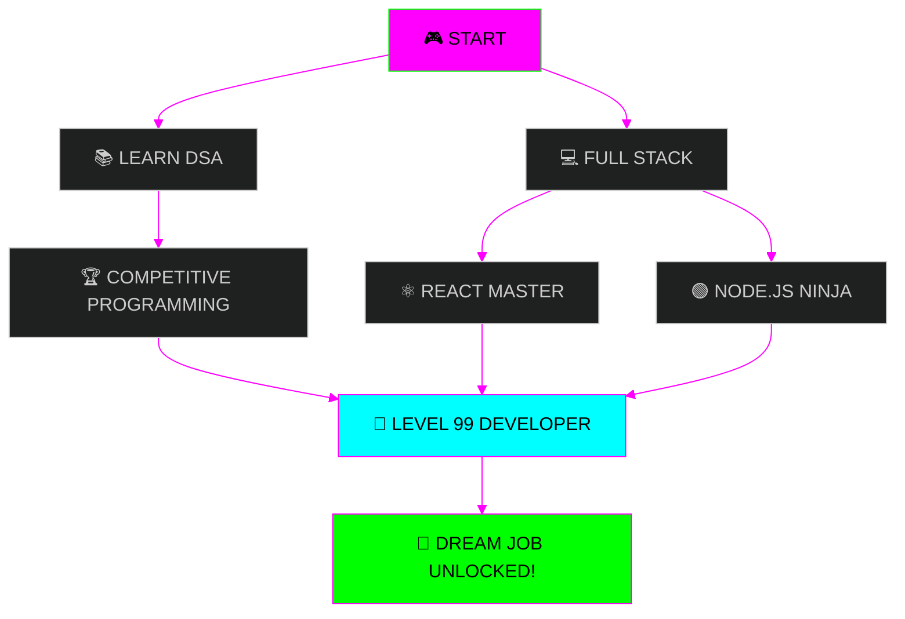

<div align="center">

<!-- Retro Pixel Art Header -->


<!-- Retro Typing Animation -->
</a>

<!-- Retro Badges -->
<p align="center">
  
  
  
  
</p>


<!-- Pixel Art Divider -->


</div>

<!-- Snake Animation -->
<div align="center">
  
</div>


---

## 🎮 PLAYER STATS

<div align="center">

```
┌─────────────────────────────────────────────────────────┐
│                    PLAYER: BIPTU                        │
│                    LEVEL: ∞                             │
├─────────────────────────────────────────────────────────┤
│                                                         │
│  LOCATION     : India 🇮🇳                               │
│  CLASS        : Full Stack Developer                   │
│  HP           : ████████████████████ 100%              │
│  MP           : ████████████████████ 100%              │
│  XP           : Continuously Grinding...               │
│                                                         │
│  WEAPONS      : Java, Python, JavaScript, C            │
│  ARMOR        : React, Node.js, MySQL, MongoDB         │
│  SPECIAL MOVE : Problem Solving Jutsu                  │
│                                                         │
│  QUEST        : Mastering DSA & Building Epic Projects │
│  ACHIEVEMENT  : Built Ludo Game in Java! 🎲           │
│                                                         │
└─────────────────────────────────────────────────────────┘
```

</div>

<details>
<summary>🎯 PRESS A TO VIEW MORE STATS</summary>
<br>

```
╔═══════════════════════════════════════════════╗
║           EXTENDED PLAYER INFO                ║
╠═══════════════════════════════════════════════╣
║                                               ║
║  🔭 CURRENT QUEST:                            ║
║     > Full Stack Projects                     ║
║                                               ║
║  🌱 SKILL TRAINING:                           ║
║     > Data Structures & Algorithms            ║
║                                               ║
║  👥 PARTY MODE:                               ║
║     > Looking for Open Source Guilds          ║
║                                               ║
║  💬 CHAT TOPICS:                              ║
║     > Java | JavaScript | Python              ║
║                                               ║
║  🎮 BONUS STAGE:                              ║
║     > "Code is like humor.                    ║
║        When you have to explain it,           ║
║        it's bad!"                             ║
║                                               ║
╚═══════════════════════════════════════════════╝
```

</details>

---

## 🕹️ TECH LOADOUT

<div align="center">

### ⚔️ WEAPONS (Programming Languages)

<table>
  <tr>
    <td align="center" width="96">
      
      <br><sub><b>JAVA</b></sub>
      <br><sub>⭐⭐⭐⭐⭐</sub>
    </td>
    <td align="center" width="96">
      
      <br><sub><b>JAVASCRIPT</b></sub>
      <br><sub>⭐⭐⭐⭐⭐</sub>
    </td>
    <td align="center" width="96">
      
      <br><sub><b>PYTHON</b></sub>
      <br><sub>⭐⭐⭐⭐⭐</sub>
    </td>
    <td align="center" width="96">
      
      <br><sub><b>C LANG</b></sub>
      <br><sub>⭐⭐⭐⭐</sub>
    </td>
  </tr>
  <tr>
    <td align="center" width="96">
      
      <br><sub><b>HTML5</b></sub>
      <br><sub>⭐⭐⭐⭐⭐</sub>
    </td>
    <td align="center" width="96">
      
      <br><sub><b>CSS3</b></sub>
      <br><sub>⭐⭐⭐⭐</sub>
    </td>
    <td align="center" width="96">
      
      <br><sub><b>REACT</b></sub>
      <br><sub>⭐⭐⭐⭐</sub>
    </td>
    <td align="center" width="96">
      
      <br><sub><b>NODE.JS</b></sub>
      <br><sub>⭐⭐⭐⭐</sub>
    </td>
  </tr>
</table>

### 🛡️ ARMOR (Tools & Databases)

```
┌─────────┬─────────┬─────────┬─────────┬─────────┬─────────┐
│   GIT   │  GITHUB │   VS    │ JUPYTER │  MySQL  │ MongoDB │
│         │         │  CODE   │         │         │         │
│  ▓▓▓▓▓  │  ▓▓▓▓▓  │  ▓▓▓▓▓  │  ▓▓▓▓▓  │  ▓▓▓▓▓  │  ▓▓▓▓▓  │
└─────────┴─────────┴─────────┴─────────┴─────────┴─────────┘
```

</div>


---

## 📊 GAME STATS

<div align="center">

<table>
  <tr>
    <td>
      
    </td>
    <td>
      
    </td>
  </tr>
</table>


</div>


---

## 🏆 ACHIEVEMENT UNLOCKED

<div align="center">


### ⚡ CONTRIBUTION POWER LEVEL ⚡


</div>


---

## 🎯 BOSS BATTLES (Featured Projects)

<div align="center">

```
╔══════════════════════════════════════════════════════════╗
║                    LEVEL SELECT                          ║
╚══════════════════════════════════════════════════════════╝
```

<table>
  <tr>
    <td width="50%">

### 🎲 LUDO GAME BOSS
      
```
┌────────────────────────────┐
│      FINAL BOSS!           │
│   ▓▓▓▓▓▓▓▓▓▓▓▓▓▓▓         │
│                            │
│   WEAPON: Java             │
│   DIFFICULTY: ⭐⭐⭐⭐      │
│   STATUS: DEFEATED!        │
└────────────────────────────┘
```

[](https://github.com/biptu123/LudoGame)


</td>
<td width="50%">

### ☕ JAVA DUNGEON
      
```
┌────────────────────────────┐
│   TRAINING GROUNDS         │
│   ▓▓▓▓▓▓▓▓▓▓▓▓▓▓▓         │
│                            │
│   WEAPON: Java             │
│   DIFFICULTY: ⭐⭐⭐       │
│   STATUS: MASTERED!        │
└────────────────────────────┘
```

[](https://github.com/biptu123/JavaProgram)


</td>
  </tr>
  <tr>
    <td width="50%">

### ⚡ JS QUEST
      
```
┌────────────────────────────┐
│   SIDE QUEST               │
│   ▓▓▓▓▓▓▓▓▓▓▓▓▓▓▓         │
│                            │
│   WEAPON: JavaScript       │
│   DIFFICULTY: ⭐⭐⭐       │
│   STATUS: IN PROGRESS      │
└────────────────────────────┘
```

[](https://github.com/biptu123/JavaScript)


</td>
<td width="50%">

### 💡 ML ARENA
      
```
┌────────────────────────────┐
│   SPECIAL STAGE            │
│   ▓▓▓▓▓▓▓▓▓▓▓▓▓▓▓         │
│                            │
│   WEAPON: Python           │
│   DIFFICULTY: ⭐⭐⭐⭐      │
│   STATUS: COMPLETED!       │
└────────────────────────────┘
```

[](https://github.com/biptu123/The-Sparks-Foundation)


</td>
  </tr>
</table>

</div>


---

## 🗺️ SKILL TREE

<div align="center">



</div>


---

## 🎪 ARCADE MODE (When Not Coding)

<div align="center">

```
╔════════════════════════════════════════════════╗
║            PLAYER ACTIVITIES                   ║
╠════════════════════════════════════════════════╣
║                                                ║
║  🎮 GAMING          ▓▓▓▓▓▓▓▓▓▓ 100%          ║
║  🛠️ BUILDING         ▓▓▓▓▓▓▓▓▓▓ 100%          ║
║  🌟 OPEN SOURCE     ▓▓▓▓▓▓▓▓░░  80%          ║
║  💡 LEARNING        ▓▓▓▓▓▓▓▓▓▓ 100%          ║
║  🧩 PROBLEM SOLVING ▓▓▓▓▓▓▓▓▓▓ 100%          ║
║  📐 SYSTEM DESIGN   ▓▓▓▓▓▓▓░░░  70%          ║
║                                                ║
╚════════════════════════════════════════════════╝
```

</div>


---

## 📡 MULTIPLAYER MODE (Connect With Me)

<div align="center">

```
┌─────────────────────────────────────────────────┐
│         CHOOSE YOUR CONNECTION METHOD           │
└─────────────────────────────────────────────────┘
```

<table>
  <tr>
    <td align="center" width="33%">
      
      <br><br>
      <a href="https://github.com/biptu123">
        
      </a>
    </td>
    <td align="center" width="33%">
      
      <br><br>
      <a href="https://linkedin.com/in/biptudas">
        
      </a>
    </td>
    <td align="center" width="33%">
      
      <br><br>
      <a href="mailto:biptudas10@gmail.com">
        
      </a>
    </td>
  </tr>
</table>

</div>


---

## 🎰 RANDOM BONUS STAGE

<div align="center">

### 💬 DEVELOPER WISDOM


### 😂 ARCADE JOKE


</div>


---

<!-- Retro Footer -->


<div align="center">

```
╔════════════════════════════════════════════════════════╗
║                                                        ║
║   █▀▀ █▀█ █▀▄ █▀▀   █ █▀   █▀█ █▀█ █▀▀ ▀█▀ █▀█ █▄█   ║
║   █▄▄ █▄█ █▄▀ ██▄   █ ▄█   █▀▀ █▄█ ██▄  █  █▀▄  █    ║
║                                                        ║
║          WRITTEN IN LOGIC & LOVE                       ║
║                                                        ║
║   Made with ❤️ by Biptu | Powered by ☕ & 🎵         ║
║                                                        ║
║   ⭐ Star my repos if you found this epic! ⭐         ║
║                                                        ║
║        © 2026 BIPTU'S ARCADE • ALL RIGHTS RESERVED     ║
║                                                        ║
╚════════════════════════════════════════════════════════╝
```


### 🎮 CONTINUE? (10... 9... 8...)

</div>
